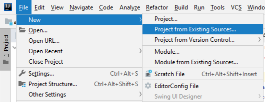
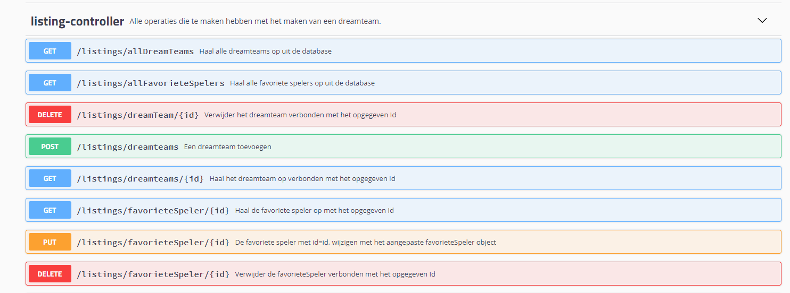

# Dreamteam applicatie :soccer:

## Project beschrijving

Het project dat hier wordt uitgewerkt is een applicatie gefocust rond voetbal.
Het doel is om van verscheidene competities de teams en spelers te tonen. Hiermee zal de gebruiker dan de de mogelijkheid hebben om zijn eigen **Dreamteam** samen te stellen met zijn favoriete spelers.

## Wat zit er in deze Repo?

In deze repo bevindt zich de frontend en de backend van onze Spring Boot applicatie: Dreamteam.
De frontend is gemaakt met het Angular framework en haalt data op met de gratis te gebruiken sportsdb API die je terug kan vinden op het volgende adres (https://www.thesportsdb.com/).

De backend van dit project maakt gebruik van micro applicaties = **microservices**. Deze microservices hebben 1 repository, 1 database tabel en mogelijks 1 controller. Ik zeg mogelijks omdat de voordeur van deze applicatie een aparte service is die volledig in contact staat met de frontend van dit project. Deze **edge-service** communiceert met alle andere backend services en bevat de controller(s) met methodes voor elke service. Om dit geheel draaiende te krijgen is er ook nog de discovery-service of **Eureka Server**. Deze zorgt ervoor dat de REST communicatie kan verlopen met dynamische URLs.

## Waarom microservices?

Waarom kozen we ervoor om onze applicatie op deze manier op te bouwen en niet op de traditionele manier?
Bij een traditionele "Monolitische applicatie" kan het voorvallen dat er meer vraag is naar bijvoorbeeld: Favoriete spelers dan dreamteams. Als dit gebeurt dan kunnen er lange wachttijden onstaan voor de gebruikers.

Dit is niet het geval als we gebruik maken van het microservice model. Als er meer vraag is naar 1 bepaalde service, dan kunnen daar meerdere instanties van gestart worden om de vraag er naar te beantwoorden. Op deze manier wordt onze applicatie zeer dynamisch naargelang gebruik ervan.

Dit project en dus de microservices werden opgebouwd met behulp van Spring Boot. Met volgende link kan je meer te weten komen over Spring.
https://spring.io/

## Installatie

 * Kloon ons project via: git clone https://github.com/wesleyjanse/DreamTeam.git
 
 * Als je een service opent doe dit dan via File> New> Project from Existing Sources... > Selecteer dan de pom.xml file van de service. Op deze manier worden zeker alle Maven dependencies geinstalleerd.

 ## Gebruik
 
 Om het project te gebruiken moet je zeker op letten dat de Eureka Server, Zuul Gateway en alle andere microservices opstaan!
 
 ## Swagger
 
 De edge-service in dit project werd ook gedocumenteerd met Swagger. Als je hier graag eens een kijkje naar neemt moet je de Eureka en Edge service opstarten en vervolgens ga je naar http://localhost:8050/swagger-ui.html
 
 ## Routes en methodes
 De Listing controller
 
 ## Context
 
 Dit project is een school opdracht die gemaakt werd voor het vak Java Advanced Topics. De school in kwestie is Thomas More.
 
 ## Auteurs
  * Wesley Janse (wesleyjanse)
  * Agit Basar (agit15)
  * Liam Mentens (r0703354)
  * Brecht Snoeck (BrechtSnoeck)
  
### Git stappenplan voor auteurs:

 * Stap1: git add .
 * Stap2: git commit -m "comment"
 * Stap3: git pull --rebase
 * Stap4: git push

### APi:
https://www.thesportsdb.com/

